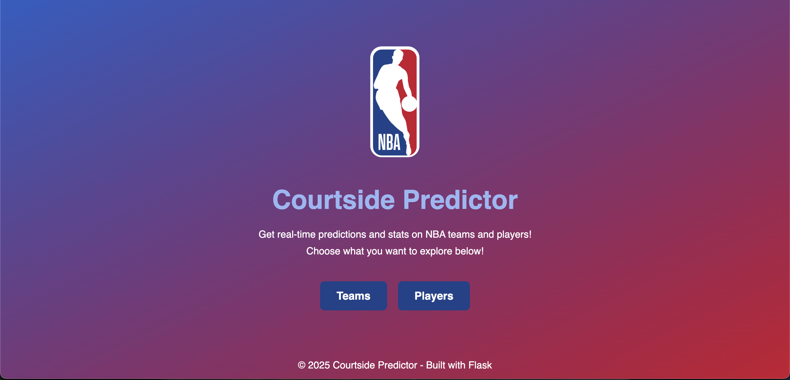
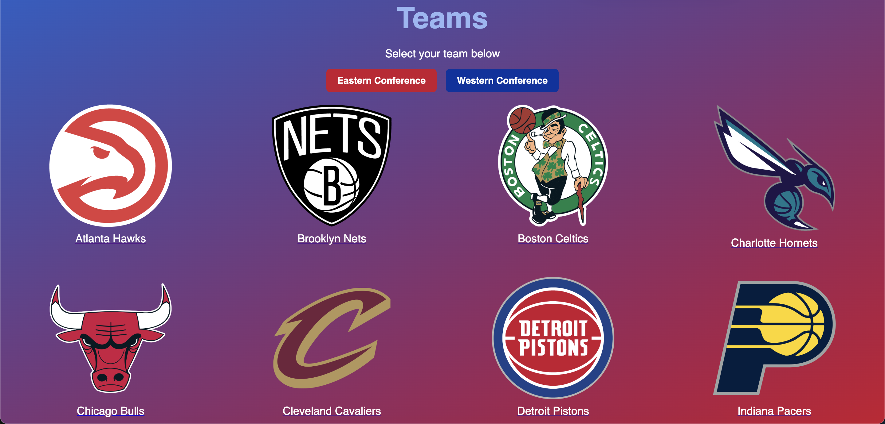
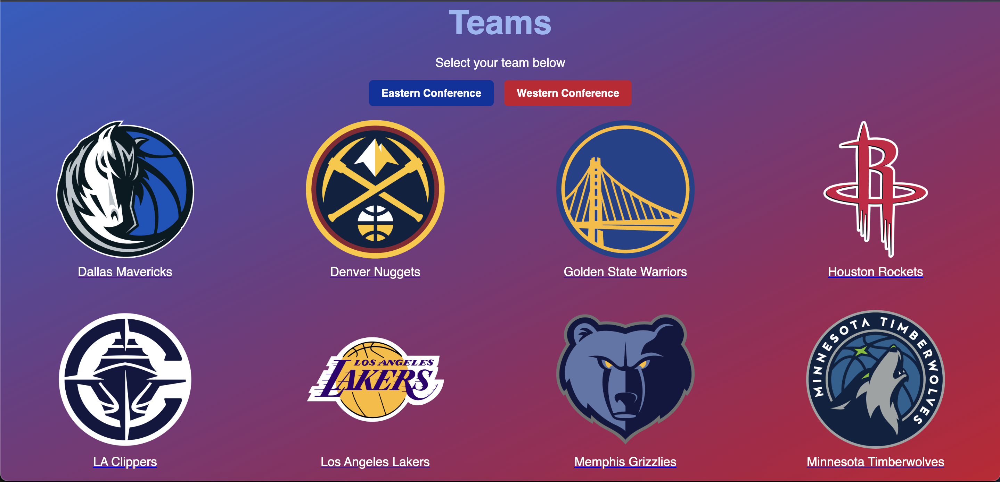
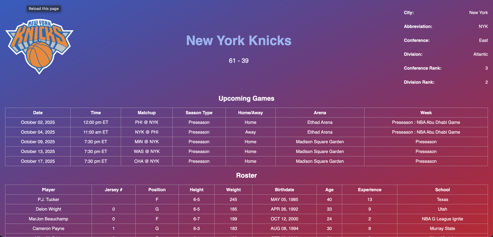
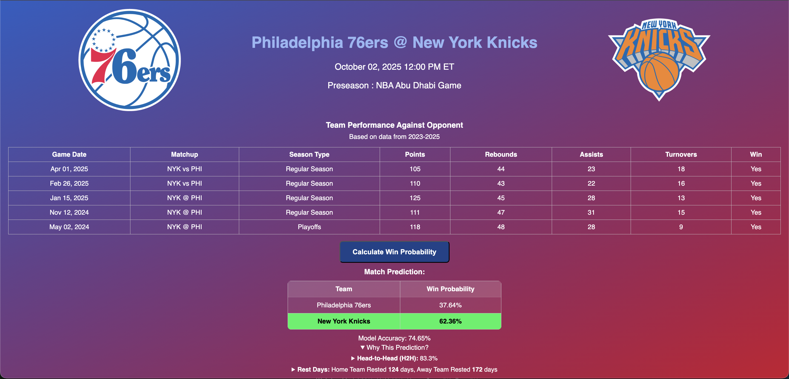
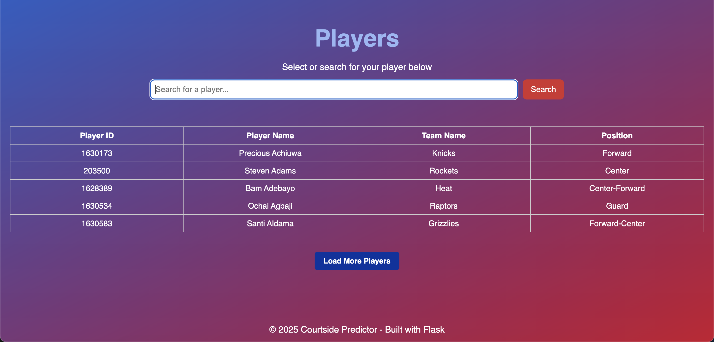
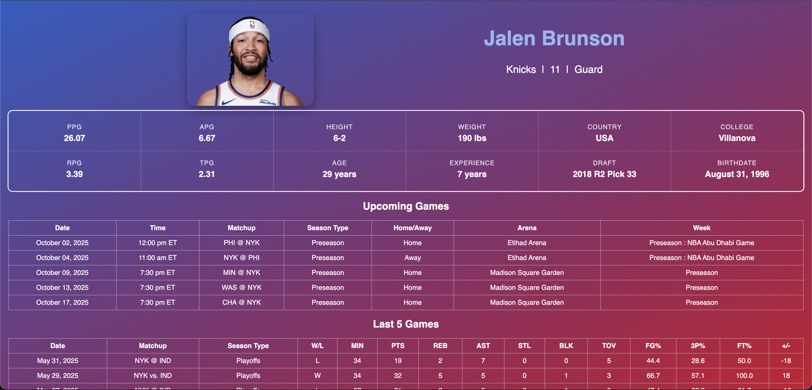
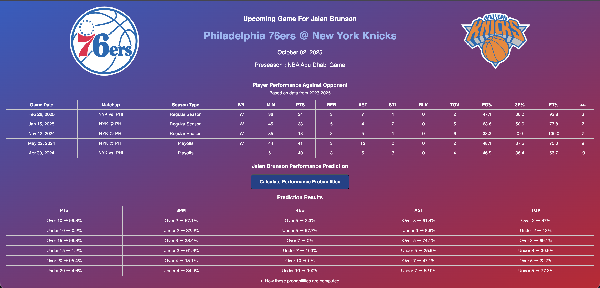

# Courtside Predictor

Courtside Predictor is a full-stack machine learning project that analyzes 300+ NBA games (2023–2025) to help fans and analysts explore historical data and forecast upcoming matchups.
The app predicts:

Team Win Probabilities for the 2025–26 NBA season

Player Over/Under Performance Probabilities based on recent trends

All predictions are backed by logistic regression models (scikit-learn), achieving 74.65% historical accuracy.


## Tech Stack

Languages: Python, HTML, CSS, JavaScript

Frameworks & Libraries: Flask, Pandas, scikit-learn

APIs: nba_api (game, team, and player data)

Other: RESTful Flask routing, responsive front-end


## Features

Interactive Web Interface – Navigate team and player stats through a clean UI

Real-Time Data Pipeline – Collects and processes data from nba_api

Predictive Analytics – Logistic regression models for win probability and player projections

Responsive Design – Works smoothly on desktop and mobile

Scalable Architecture – Modular codebase for future ML model upgrades


## Project Highlights

300+ games analyzed from 2023–2025

74.65% model accuracy on historical data

Predicts outcomes for all 30 NBA teams and key player stats

Built with clean, well-documented, production-ready code


## Screenshots

### Home Page

* Landing page with quick access to team and player stats, built with a clean and responsive UI.

### Eastern Conference Teams Page

* Displays all Eastern Conference teams with clickable logos for exploring team stats.

### Western Conference Teams Page

* Displays all Western Conference teams with clickable logos for exploring team stats.

### Team Stats Page

* Shows 5 upcoming games information, roster information & last 20 games for a selected team with averages for points, assists, rebounds, and turnovers. Matchups in upcoming games and player names in roster are clickable.

### Team Upcoming Game Page

* Provides a detailed breakdown of an individual upcoming game for current team against specified opponent, including past matchup statistics against the specified opponent. Just below is a predictor button that will determine the probability of a team winning the upcoming matchup, followed by a brief description of how we got that calculation.

### Player Search Page

* Search interface for finding any NBA player and pulling their recent performance data.

### Player Stats Page

* Displays a player’s 5 upcoming matchups information and the last 5 games performance statistics. Matchups in upcoming games are clickable.

### Player Game Page

* Detailed view of an individual game’s stats for a selected player against the specified opponent, including past matchup player performance statistics against the specified opponent. Just below is a predictor button that will determine the probability of the player going over/under in points, three pointers, rebounds, assists and turnovers.


# Run Locally

### 1. Clone the repo
git clone https://github.com/wespitia05/NBA_Predictor_Project.git
cd courtside-predictor

### 2. Install dependencies
pip install -r requirements.txt

### 3. Run the Flask app
python main.py
```